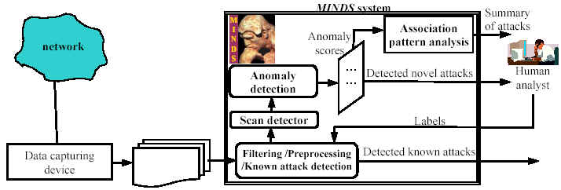

The overall objective of this research is to develop high performance data mining algorithms and tools that will provide support required to analyze the massive data sets generated by various processes that monitor computing and information systems. This research is being conducted as a part of **MINDS (Minnesota Intrusion Detection System)** project that is developing a suite of data mining techniques to automatically detect attacks against computer networks and systems. 

Figure below illustrates the MINDS system applied to real network traffic data. There are several integral parts of the research within this project: 

- Filtering / Preprocessing / Known attack detection module
- Scan detector
- Anomaly detection algorithms 
- Summarization of attacks using association pattern analysis

> Click [here](./docs/minds.pdf) for an overview of MINDS and [here](./docs/minds_manual.pdf) for an installation manual.

# Using MINDS
> The MINDS system is being used by the University of Minnesota (UM) network security analysts in a production mode, as follows. The UM network traffic is independently monitored using SNORT, an open source network intrusion detection system based on signatures, as well as using MINDS. As the first step in MINDS, the net flow tools are used to collect the network traffic data from CISCO routers. This data is filtered to remove network connections not interesting for analysis and preprocessed to collect basic features (such as source and destination IP addresses, source and destination ports, protocols) and to extract some derived features (such as number of flows to unique destination IP addresses inside the network within the last T seconds from the same source). Such created data is fed into the MINDS system. The known attack detection module detects network connections that correspond to attacks for which the models are known. The remaining connections are fed to the anomaly detection modules, which assigns a score that reflects how anomalous the connection is compared to the normal network traffic. Connections that are highly anomalous are analyzed by the UM network security analysts to determine if they are truly intrusions are false alarms. Highly anomalous connections are further analyzed and summarized using association pattern analysis. Such association rules provide a concise characterization of the detected anomalies, and are helpful in creating new signatures and models for emerging attacks.

> The University of Minnesota network security analysts has been using MINDS successfully to detect novel intrusions that could not be identified using state-of-the-art signature-based tools such as SNORT. Many of these attacks detected by MINDS, have already been on the CERT/CC list of recent advisories and incident notes. In the absence of manual screening of incoming network connections, it is not possible to provide any estimate of MINDS's detection rate (i.e. the fraction of attacks that are identified by MINDS as anomalous). However, nearly all connections that are ranked highly by our anomaly detection algorithms are found to be interesting and anomalous by the network security analyst on our team. Summarization of anomalous connections using association pattern analysis has been very helpful in understanding nature of cyber attacks as well as in creating new signature rules for intrusion detection systems. 

